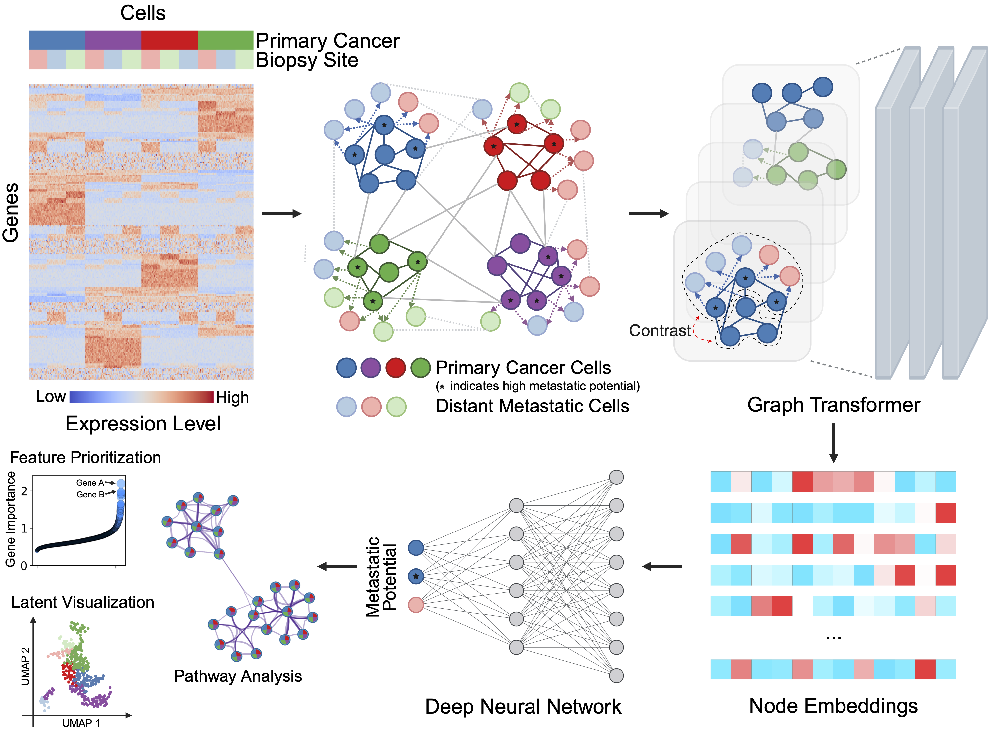

# scMeta: Predicting Metastasis Potential at Single-cell Resolution

***

scMeta is a graph transformer–based deep learning framework for predicting metastatic potential at single-cell resolution from transcriptomic data. It constructs a cell–cell graph based on transcriptional similarity, learns context-aware embeddings via attention-based message passing, and uses these embeddings for metastasis classification, biomarker prioritization, and pathway enrichment analysis.

*** 

## Requirements 
Required packages:
- [Scanpy](https://scanpy.readthedocs.io/en/stable/) (1.9.6)
- [Anndata](https://anndata.readthedocs.io/en/latest/) (0.9.2)
- [Pytorch](https://pytorch.org/) (2.3.0+cu118)
- [Matplotlib](https://matplotlib.org/stable/) (3.5.3)
- [scikit-learn](https://scikit-learn.org/stable/) (1.3.0)
- [seaborn](https://seaborn.pydata.org/index.html) (0.12.2)
- [PyG](https://pytorch-geometric.readthedocs.io/en/latest/index.html) (2.6.1)
- [Harmony-Pytorch](https://github.com/lilab-bcb/harmony-pytorch) (0.1.8) (for integration only)
- [scVI](https://infercnvpy.readthedocs.io/en/latest/index.html) (1.4.0) (for integration only)
- [infercnvpy](https://infercnvpy.readthedocs.io/en/latest/index.html) (0.6.1) (for pre-processing only)
- CUDA version: 11.8

## Repository layout

Scripts are grouped by pipeline stage under `src/`; unqualified filenames
mentioned elsewhere in this README live in one of these directories:

- `src/model/`: `scMeta.py`, `train_v2.py`, `train_v2b.py`, `label_rules.py`,
  `inductive_saliency.py`, `diagnose_homophily.py`, `train_no_distant_v2.py`
- `src/table1/`: `table1_r3_*.py` (Table 1 regeneration pipeline and its
  `table1_r3/` cache/checkpoint/runs output directory)
- `src/downstream/`: GSEA/DEG/GO-comparison/saliency scripts
  (`run_gsea*.py`, `run_go_comparison*.py`, `run_sub_benchmark.py`,
  `run_deg_benchmark.py`, `run_baseline_gsea.py`,
  `run_differential_saliency_full.py`, `test_differential_saliency.py`,
  `draw_umap.py`, `ovarian_subtype_breakdown.py`) and their output
  directories/CSVs
- `src/healthy_control/`: `test_healthy_v2.py`, `test_healthy_v3.py`,
  `regen_supfig4.py`, `plot_supfig4.py` and their SLURM launchers/outputs
- `src/delong/`: `delong.py`, `compare_models_delong.py` and the DeLong
  result tables
- `figure_regen/`, `Pre-processing/`, `Reproducibility/`, `data/`: unchanged

## Reproducibility:

- [Data pre-processing](https://github.com/loooooooopi/scMeta/tree/master/Pre-processing)
  - The four Pre-processing notebooks contains all information for inidividual studies, including the source for raw data and annotations.
  - InferCNV was ran in a sperate notebook.
  - Final integration of all datasets was in Integrate all data.ipynb.
  - `label_rules.py` (`src/model/`) is the single, explicit rule that assigns each malignant
    cell's `metastasis_label` (No_Mets / Regional_Mets / Distant_Mets) from its cancer type
    and biopsy site (`Final_cancer_type`, `Final_tissue_backup`), applied uniformly across
    all four cancer types and all studies. Every script that reads `metastasis_label`
    (`train.py`, `train_no_distant.py`, `run_gsea*.py`, `run_sub_benchmark.py`,
    `run_deg_benchmark.py`, `draw_umap.py`) calls `recompute_metastasis_label(adata)` from
    this module immediately after loading the atlas, so the label is always derived fresh
    from the same rule rather than read from a pre-baked column.
    See `Pre-processing/old_label_rule_audit.md` for a per-dataset audit of the previous
    (inconsistent) labelling logic, and `Pre-processing/label_truth_table.csv` for the
    per-site truth table of old vs. new labels.
  - Note: The raw and processed data used in training scMeta and trained best models will be deposited to Zenodo soon.
- [Baseline model](https://github.com/loooooooopi/scMeta/blob/master/Reproducibility/baseline_models.ipynb)
  - This notebook contains the code for 5 fold CV and LOOCV using 3 classical machine learning models as baselines.
- [scMeta (main model)](https://github.com/loooooooopi/scMeta/tree/master/Reproducibility)
  - [5 fold CV notbook](https://github.com/loooooooopi/scMeta/blob/master/Reproducibility/scMeta_5foldCV.ipynb)
  - [LOOCV notbook](https://github.com/loooooooopi/scMeta/blob/master/Reproducibility/scMeta_LOOCV.ipynb)
- [Downstream analysis including feature priorization and pathway analysis](https://github.com/loooooooopi/scMeta/blob/master/Reproducibility/scMeta_downstream_analysis.ipynb)

***

## Train on new data and predict for new samples

Tutorials are provided in: [train new model](https://github.com/loooooooopi/scMeta/blob/master/train.ipynb)

## Revision 3 additions (Reviewer 2 response)

- `label_rules.py`: unified biopsy-site-based metastasis label rule (see above).
- `train_v2.py`: patient-stratified 5-fold CV and leave-one-cancer-type-out (LOCO)
  CV, with a real inductive evaluation (`NeighborLoader` seeded at held-out cells,
  replacing the previous self-loop-only inference) and a plain-MLP baseline
  (`scMetaMLP` in `scMeta.py`, same layer widths, no message passing) trained and
  evaluated identically for comparison. Results in `v2_results.csv`.
- `diagnose_homophily.py`: checks whether the malignant-cell kNN graph is
  homophilous with respect to `metastasis_label`, and how much of that
  homophily is attributable to same-patient/same-cancer-type edges versus
  genuine cross-patient transcriptional similarity.
- `train_v2b.py`: retrains scMeta with `graph_nt_xent` (in `scMeta.py`), a
  contrastive loss that uses real graph edges as positive pairs, replacing the
  original `NT_Xent`, which pairs each embedding with a randomly permuted one
  and is blind to `edge_index`. Only scMeta is retrained here; the MLP
  baseline is unaffected by this change and its numbers are reused from
  `v2_results.csv`. Results in `v2b_results.csv`. This ("scMeta-graphloss")
  is the model version used everywhere else below.
- `delong.py` / `compare_models_delong.py`: DeLong's test for comparing two
  models' AUC on the same paired per-cell predictions within a split --
  much higher-powered than a paired t-test across only 5 CV folds. Reuses
  the checkpoints already saved by `train_v2.py`/`train_v2b.py` (no
  retraining). Results in `delong_results.csv`: scMeta-graphloss
  significantly outperforms both the MLP baseline and the original scMeta
  in 7/8 splits (all 3 LOCO splits with a defined AUC, plus 4/5 CV folds;
  Colorectal LOCO is excluded here since it has no defined AUC -- see
  `label_rules.py` note above); CV fold 1 is the one exception, where the
  MLP baseline and the original scMeta both significantly outperform
  scMeta-graphloss.
- `ovarian_subtype_breakdown.py`: breaks the near-chance Ovarian Cancer LOCO
  result down by biopsy-site subtype (Omentum/Peritoneum/Ascites/Bowel/Upper
  Quadrant, all currently pooled into `Regional_Mets`). Finding: the failure
  isn't uniform -- Omentum (the largest subtype) shows a systematic
  *reversed* prediction, while Upper Quadrant is the only subtype with a
  correctly-directed signal. Output: `ovarian_subtype_breakdown.csv`.
- `test_healthy_v2.py` (replaces `test_healthy.py`): healthy-cell negative
  control (Reviewer 2 point 3) using 43,522 Tabula Sapiens epithelial cells
  (7 donors: lung, mammary gland, large intestine, ovary), bridged into the
  malignant-cell graph via approximate kNN (`pynndescent`) in the training
  feature space, then evaluated with real inductive inference instead of
  self-loops. Headline metric is the plain-argmax false positive rate (no
  confidence threshold, unlike the old p>0.90-threshold approach, which
  folded "unconfident" predictions into the reported success rate): 0.94%
  for the 5-fold probability-averaged ensemble. Also reports a
  threshold-free ROC/PR curve per fold (malignant validation cells + all
  healthy cells as an augmented negative class). Outputs:
  `healthy_negative_control_results.csv`, `healthy_donor_summary.csv`,
  `healthy_cell_predictions.csv`, `healthy_tissue_summary.csv`.
- `inductive_saliency.py`: shared utility for gradient/saliency-based feature
  importance (used by `run_gsea.py` and `run_sub_benchmark.py`), fixing the
  same self-loop-only `edge_index` bug in the biological-interpretation
  scripts (Reviewer 2 point 2) -- gradients are now computed via a real
  `NeighborLoader`-sampled subgraph instead of `arange(N).repeat(2, 1)`.
- `run_gsea.py`: all three scenarios (`local_global`, `distant_global`,
  `local_subpop`) rerun with the fixed graph + `scMeta-graphloss` +
  unified labels. The most EMT-enriched leiden cluster is now **56**, not
  the old **59** (relabeling + remodeling shifted the clustering) -- EMT
  ranks #2 in that cluster's own top pathways (NES=1.356, FDR=0.172, not
  significant at the conventional 0.05 threshold). `draw_umap.py` and
  `run_deg_benchmark.py` were updated to point at cluster 56. **This
  NES/FDR pair is the one-sided gradient-magnitude signal, computed before
  the differential-signal fix described further below** -- the corrected,
  manuscript-matching number for Cluster 56 EMT is NES=1.60, FDR=0.036
  (`compute_differential_saliency`, see the `test_differential_saliency.py`
  entry below).
- `run_baseline_gsea.py` / `run_sub_benchmark.py`: both previously grouped
  cells by `metastasis_label` without first restricting to
  `Final_cell_type == 'Malignant'` -- since the label is a tissue/cancer-type
  based property of every cell in the atlas, not just malignant ones, this
  meant the baseline Logistic Regression and per-cluster benchmark could
  include non-malignant cells from labeled tissues. Both now filter to
  Malignant cells first. `run_sub_benchmark.py` also had the self-loop bug
  (fixed via `inductive_saliency.py`) and a ProcessPoolExecutor design that
  silently failed every cluster's GPU-based method (forked workers can't
  reinitialize CUDA) -- now runs sequentially. Full results:
  `gsea_sub_benchmark_v2_summary/Master_EMT_Benchmark_Summary.csv`.
  **Notable finding (one-sided gradient signal, superseded below)**: across
  all 45 clusters tested, only the plain Wilcoxon DEG method reaches
  FDR<0.05 for EMT (clusters 56, 58); no scMeta-gradient-based method
  (`scMeta_Conf_*` columns, one-sided average |grad x x| magnitude) reaches
  significance in any cluster, at any confidence threshold. The
  `compute_differential_saliency` fix described below changes this --
  see that entry for the corrected 2/45 result and the third
  Wilcoxon-only cluster (7) it also turned up.
  (`Confident_Cells` in this CSV was also corrected for the
  `Wilcoxon_DEG`/`Baseline_LR` rows: a `dict.get(0, n_target)` fallback
  spuriously matched the float key `0.0` used by `scMeta_Conf_0`, since
  `0 == 0.0` in a Python dict lookup, silently substituting that
  threshold's pooled cell count for the true cluster size on every
  non-scMeta row. `GSEA_NES`/`GSEA_FDR` were computed from the correct
  rankings throughout and are unaffected -- only the reported cell count
  was wrong. Fixed in both the script and the existing CSV.)
- `train_no_distant_v2.py` (replaces `train_no_distant.py`): the Distant-
  Metastasis-excluded robustness experiment (main.tex, "AUC 0.772,
  Supplementary Table S10") already used the unified label rule but still
  evaluated with the same self-loop-only `edge_index` bug (Reviewer 2
  point 2). Reuses `prepare_data()` from `train_no_distant.py` (unchanged)
  and `evaluate_inductive()` from `train_v2.py` (real NeighborLoader
  evaluation, identical hyperparameters) instead of duplicating that
  logic. Result: mean AUC **0.790** (5-fold range 0.696--0.908) --
  slightly *higher* than the original self-loop number, not lower.
  Results: `no_distant_v2_results.csv`.
- `Reproducibility/scMeta_5foldCV.ipynb`, `scMeta_LOOCV.ipynb`, and
  `scMeta_downstream_analysis.ipynb` each have the same self-loop eval bug
  repeated in several cells and were not patched in place (would duplicate
  `train_v2.py`/`train_v2b.py`); each now has a markdown cell at the top
  explaining this and pointing to the authoritative post-fix results.
- `Pre-processing/Integrate all data.ipynb` now calls
  `recompute_metastasis_label()` right after `Final_cancer_type` /
  `Final_tissue_backup` are finalized, so the saved atlas carries the
  correct `metastasis_label` from the source rather than relying on every
  downstream script to patch it in.
- `run_go_comparison.py` (one-sided gradient signal, superseded below by
  `run_go_comparison_differential.py`): re-tests the manuscript's per-cancer-type claim
  (main.tex, R1->R2 `\addvtwo{}` text) that scMeta's gradient attribution
  recovers GO Biological Process pathways missed by conventional DEG.
  Reuses the corrected per-cancer-type gradient rankings already computed
  by `run_gsea.py --scenario local_subpop`, and computes a matching
  Wilcoxon DEG ranking (Regional_Mets vs. No_Mets, Malignant cells only)
  per cancer type. Enriches both against MSigDB C5 GO Biological Process
  (`data/c5.go.bp.v2024.1.Hs.symbols.gmt`) via `gp.prerank`. Colorectal
  Cancer's DEG arm is skipped: too few Regional_Mets cells under the
  unified label rule (consistent with `v2b_results.csv` reporting
  accuracy-only, no AUC, for the Colorectal LOCO split).
  **Finding**: like the EMT benchmark above, this does not hold up.
  scMeta and Wilcoxon DEG find small, almost entirely non-overlapping sets
  of significant GO BP terms (breast 3 vs. 3, 0 shared; lung 3 vs. 6, 0
  shared; ovarian 4 vs. 0). None of the specific canonical
  metastasis-associated processes the manuscript names (regulation of cell
  migration, cell-cell/cell-matrix adhesion, ERK1/2 signaling, apoptotic
  processes, cell population proliferation) are significantly enriched by
  either method in any cancer type (FDR 0.6-1.0 throughout) -- the
  original named examples don't survive the corrected pipeline, not just
  the "who found it first" framing. Separately, the four genes the
  manuscript names as top scMeta hits per cancer type (CYP1A1, PPBP,
  APOC2, SLC6A3) are also not reproducible under the corrected, unified
  1,579-gene feature space: three aren't in that feature space at all, and
  PPBP ranks last or near-last except in Colorectal. Results:
  `../go_comparison_v2/GO_comparison_summary.csv` and
  `*_scMeta_only_terms.csv` / `*_DEG_only_terms.csv` per cancer type.
- `inductive_saliency.py` / `test_differential_saliency.py` /
  `run_differential_saliency_full.py`: main.tex's own Methods
  (`\S{sec:feature_pro}`) documents a *differential* gradient signal,
  `delta_g = g_bar_class2 - g_bar_class1`, but the saliency code actually
  used throughout this revision (`compute_inductive_saliency` /
  `_multi_threshold`) only ever computed one side of that (mean |grad| for
  confidently-predicted target-class cells alone) -- it never implemented
  the documented subtraction. A gene with uniformly large gradient
  magnitude regardless of class (a plausible explanation for the
  generic/housekeeping genes and the cross-cancer-recurring complement
  receptor GO term noted above) inflates the one-sided ranking but cancels
  out in the documented differential version. `compute_differential_saliency`
  (added to `inductive_saliency.py`) implements the equation as documented
  (no confidence threshold, matching the manuscript exactly) and was
  tested, as a single pre-registered fix (not a search over methods), on
  all 45 Regional_Mets subpopulations with sufficient cells, each vs. the
  same 1:1 down-sampled Primary control used by `run_sub_benchmark.py`.
  **Result: this materially changes the finding.** The differential signal
  reaches EMT significance in 2 of 45 subpopulations (Cluster 24, n=7,887,
  NES=1.71, FDR=0.022, also significantly co-enriched for Coagulation,
  NES=1.67, FDR=0.024; Cluster 56, n=3,067, NES=1.60, FDR=0.036) --
  comparable to Wilcoxon DEG's 3 of 45 (Cluster 56, Cluster 58, and an
  EMT-*depleted* Cluster 7). Cluster 56 is significant by both methods;
  Cluster 24 is scMeta-differential-exclusive; Clusters 7 and 58 are
  Wilcoxon-exclusive. This supersedes the `scMeta_Conf_*` columns in
  `Master_EMT_Benchmark_Summary.csv` (0/45 significant, one-sided) as the
  correct representation of what the manuscript's Methods describes.
  Results: `differential_saliency_v2_summary/Differential_Saliency_Full_Summary.csv`.
  `run_go_comparison_differential.py` extends the same fix to the
  per-cancer-type GO Biological Process comparison (`run_go_comparison.py`),
  capped at 5,000 cells/class (seed=42) per cancer type for tractability --
  much smaller than the full confidently-predicted population the one-sided
  per-cancer analysis used, so this comparison has less statistical power
  than the (matched-N) cluster-level benchmark above. Breast and Ovarian
  Cancer go from 3 and 4 one-sided-significant GO BP terms to 0 with the
  differential signal at this smaller N; Lung Cancer improves from 3
  significant terms (0 overlapping Wilcoxon) to 4 (1 overlapping Wilcoxon:
  GOBP_FIBRINOLYSIS), i.e. the two independent methods corroborate each other
  on Lung Cancer specifically.
  Results: `go_comparison_differential_v2_summary/`.
- `run_go_comparison_differential_full.py`: **tests whether that 5,000-cell
  cap was costing anything, and finds it was not.** An earlier version of the
  note above speculated that Breast/Ovarian dropping to 0 significant terms
  was "consistent with reduced power at n=5,000/class rather than evidence
  the differential signal performs worse in general". That was an untested
  guess, and it is wrong. This script is byte-identical to
  `run_go_comparison_differential.py` except that `CAP_PER_CLASS` is removed,
  which raises Ovarian from 5,000 to 86,682 cells/class (17.3x), Lung from
  5,000 to 15,153 (3.0x), and Breast from 5,000 to 5,399 (1.1x). The result
  is unchanged to three decimal places:

  | | capped n=5,000 | full N |
  |---|---|---|
  | Breast/Lung cross-cancer Spearman rho | 0.304 | 0.303 |
  | Breast/Ovarian rho | 0.202 | 0.207 |
  | Lung/Ovarian rho | 0.094 | 0.095 |
  | significant GO BP terms (Breast/Lung/Ovarian) | 0 / 4 / 0 | 0 / 4 / 0 |

  Gene-level rankings are equally stable (MDK 4/1/7 -> 4/1/9 across
  Breast/Lung/Ovarian; MMP7, ENO1, MIF unchanged in position). So the modest
  cross-cancer agreement is the signal, not a sampling artifact, and the
  capped numbers reported above can be relied on. This is worth stating
  positively in the response letter: the per-cancer-type differential
  comparison is unchanged under a 17x increase in sample size.
  Results: `../go_comparison_differential_full_v2/` (the capped results are
  left untouched in `../go_comparison_differential_v2/` for comparison).
- `main.tex` / `supplementary.tex` (manuscript source, maintained in
  Overleaf -- not part of this code repository, described here only for
  traceability between the findings above and the submitted text):
  the R1->R2 (`\addvtwo{}`) and R0->R1 (`\add{}`) track-change
  colors were both reset to black (accepted into the body text); a new
  `\addvthree{}`/`\delvthree{}`/`\replacevthree{}` pair (red) marks this
  round's changes. Revised, in line with the findings above: the abstract's
  "not captured by differential expression methods" claim (softened to a
  "complement" framing), the Cluster 59/4 EMT discovery paragraph (now
  Cluster 24/56, using the differential gradient signal, both significant,
  cross-referenced against Wilcoxon's independently-found Clusters 56/58/7),
  the 69-subpopulation "superior mechanistic consistency" paragraph (now
  reports the actual 45-cluster differential-signal benchmark: scMeta 2/45
  significant, Wilcoxon 3/45, logistic-regression baseline 0/45, with
  Cluster 56 corroborated by both and each method separately catching
  subpopulations the other misses), the per-cancer-type gene examples
  (CYP1A1/PPBP/APOC2/SLC6A3 replaced with MDK/MMP7, which are reproducible
  under the corrected pipeline and literature-supported), the per-cancer-type
  GO pathway comparison paragraph (updated with the Lung Cancer/Fibrinolysis
  differential-signal corroboration finding above), and the Discussion's
  opening claim (now describes the differential signal as comparable in
  power to, and complementary with, differential expression, rather than
  superior or inferior to it). The Fatty Acid Metabolism number in the
  global gradient-attribution paragraph was also stale (NES=1.42/FDR=0.10
  originally reported, actually NES=1.27/FDR=0.32, not significant, under
  the corrected pipeline -- checked directly against
  `gsea_local_global_v2/global_results/`; Oxidative Phosphorylation was
  unaffected, FDR actually improved to 0.03) and has been corrected.

  Beyond the gradient-attribution-vs-DEG claims, this pass also addressed
  the three Reviewer 2 major points directly in the manuscript text (not
  just in code/results, which were already fixed):
  - **Point 1 (label definition)**: the Methods previously gave two
    contradictory definitions of the three classes -- one patient-stage-based
    ("primary tumors of patients with confirmed distant metastasis"), one
    biopsy-site-based ("cells originating from metastatic biopsies...
    stratified by anatomical site") -- exactly the inconsistency Reviewer 2
    flagged. Both are now replaced with a single description matching
    `label_rules.py` exactly (biopsy site only, no patient stage, explicit
    per-cancer-type locoregional site lists, colorectal has no defined
    locoregional site in this cohort).
  - **Point 2 (graph reduces to MLP)**: the Methods/Results previously never
    mentioned an MLP baseline at all (despite `train_v2.py`/`scMetaMLP`
    existing) and never stated how evaluation actually works. Added: a
    Methods paragraph stating real `NeighborLoader`-based inductive
    evaluation is used (not self-loops), and that `scMeta-graphloss` (the
    edge-aware contrastive loss variant) is the version used for all
    downstream biological analysis; a Results paragraph reporting the
    MLP-vs-`scMeta-graphloss`-vs-original-`scMeta` comparison, honestly
    including the CV-fold-1 exception where the MLP baseline wins
    (Supplementary Table S15, pointing at `v2b_results.csv` /
    `v2_results.csv` / `delong_results.csv`).
  - **Point 3 (healthy-cell control)**: both the Methods and Results
    description of the negative control experiment were rewritten to match
    `test_healthy_v2.py`'s actual reproducible methodology -- real kNN-bridge
    inductive inference, plain-argmax FPR (0.94% ensemble, 0.15-10.14% per
    fold) instead of the undisclosed $p>0.90$ threshold that previously
    conflated "classified as primary" with "rejected as unconfident",
    threshold-free ROC/PR (AUC 0.77-0.90, AUPRC 0.52-0.59), and an explicit
    note on the small Ovary donor sample (10 cells, 1 donor) as a
    limitation, replacing the previous unqualified "100% success across
    folds" framing.
  - The Distant-Mets-excluded robustness experiment's AUC was also stale
    for the same self-loop-bug reason (see `train_no_distant_v2.py` above)
    and is corrected from 0.772 to 0.790.

  The core predictive-performance claims (LOCO/CV AUC, DeLong results) are
  otherwise untouched -- these edits either fix bugs, add previously-missing
  required content, or revise the gradient-attribution-vs-DEG claims.
- `figure_regen/`: main-text Figure 2 and Figure 3 were regenerated from
  scratch this round, since the original figures (`Figure2.png`,
  `Figure3.revision.png`) predate the fixes above -- confirmed for Figure 3
  by tracing `Reproducibility/scMeta_downstream_analysis.ipynb`'s embedding
  cells, which read a different source file
  (`Cancer_cell_data_reprocessed/All_integrated.hallmark.harmony.h5ad`, not
  the atlas `train_v2.py` uses), label the three classes from
  `Primary_or_Metastatic`/`source` rather than `label_rules.py`'s unified
  rule, and train with the plain topology-blind `NT_Xent` rather than
  `graph_nt_xent`.
  - `make_figure2.py`: atlas UMAP (Figure 2). Recomputes `metastasis_label`
    via `label_rules.py`, restricts to `Final_cell_type == 'Malignant'`
    (548,382 cells, 100% of malignant cells under the new exhaustive label
    rule), and runs `sc.pp.neighbors`/`sc.tl.umap` fresh on the malignant
    subset's `obsm['X_pca_harmony']` (not the whole-atlas precomputed
    `X_umap`, which washes out malignant-cell substructure under the other
    cell types).
  - `extract_full_embeddings.py`: NeighborLoader-batched inference (reusing
    the `evaluate_inductive` pattern from `train_v2.py`) extracting
    scMeta-graphloss's 256-dim `conv2` embedding for all 548,382 malignant
    cells from the `5foldCV_fold1` checkpoint. Outputs `full_embeddings.npy`
    / `full_embeddings_meta.csv`.
  - `make_figure3a.py`: Figure 3(a), UMAP of the extracted embedding.
    PCA-denoises to 50 components before `neighbors`/`umap`
    (`n_neighbors=30`): the raw embedding has ~1/3 near-zero-variance
    (dead ReLU) dimensions and was trained with an edge-aware contrastive
    loss that produces a more locally clustery geometry than a PCA/Harmony
    manifold, so `neighbors`/`umap` directly on the raw 256-dim vectors at
    default settings fragments into many small islands (see
    `tune_figure3a_umap.py`'s 4-config sweep, which selected this
    configuration). Plotting uses small markers + partial alpha
    (`size=3, alpha=0.4`) to control overplotting noise at 548K points --
    a rendering choice only, made after visual comparison confirmed the
    UMAP coordinates themselves were the same before and after.
  - `make_go_figure.py`: Figure 3(b), the per-cancer-type (breast/lung/
    ovarian; colorectal excluded, too few `Regional_Mets` cells) GO
    Biological Process bar chart, replacing the old heatmap's claim of GO
    pathways "shared... across breast, colorectal, lung, and ovarian
    cancers" -- which contradicts this round's `run_go_comparison.py` /
    `run_go_comparison_differential.py` finding (small, largely
    non-overlapping per-cancer-type term sets; see above). Reads
    `go_comparison_v2/*_only_terms.csv` and the matching `gseapy`
    prerank reports for NES/FDR.
  - `combine_figure3.py`: stacks `Figure3a_v2.png` and
    `Figure3b_go_pathways_v2.png` into the single two-panel `Figure3_v2.png`
    referenced by `main.tex`.
  - Both regenerated figures were produced from the same checkpoints,
    labels, and data used elsewhere in this revision (`v2b_scMeta_models/`,
    `label_rules.py`, the atlas `All_integrated.harmony.h5ad`) -- not new
    analysis, a re-rendering of already-reported results.