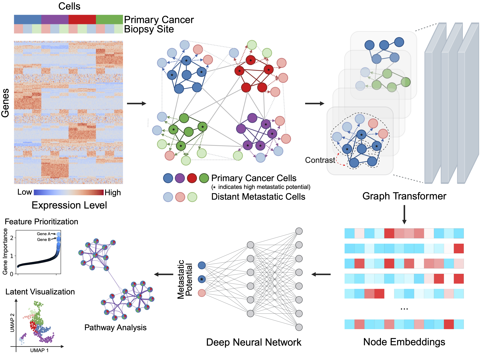

# scMeta: Predicting Metastasis Potential at Single-cell Resolution

***

scMeta is a graph transformer–based deep learning framework for predicting metastatic potential at single-cell resolution from transcriptomic data. It constructs a cell–cell graph based on transcriptional similarity, learns context-aware embeddings via attention-based message passing, and uses these embeddings for metastasis classification, biomarker prioritization, and pathway enrichment analysis.

*** 
## Requirements 
Required packages:
- [Scanpy](https://scanpy.readthedocs.io/en/stable/)
- [Anndata](https://anndata.readthedocs.io/en/latest/)
- [Pytorch](https://pytorch.org/)
- [Matplotlib](https://matplotlib.org/stable/)
- [scikit-learn](https://scikit-learn.org/stable/)
- [seaborn](https://seaborn.pydata.org/index.html)
- [PyG](https://pytorch-geometric.readthedocs.io/en/latest/index.html)
- [Harmony](https://github.com/lilab-bcb/harmony-pytorch) (for integration only)

## Reproducibility:

- [Data pre-processing](https://github.com/loooooooopi/scMeta/tree/master/Pre-processing)
- [Baseline model1: scMeta-DNN](https://github.com/loooooooopi/scMeta/tree/master/Pre-processing)
- [Baseline model2: scMeta-Multi](https://github.com/loooooooopi/scMeta/blob/main/Reproducibility/Baseline2%20scMeta-Multi.ipynb)
- [scMeta-VAE (main model)](https://github.com/loooooooopi/scMeta/blob/main/Reproducibility/scMeta-VAE.ipynb)
- [Gradient-based feature prioritization](https://github.com/loooooooopi/scMeta/blob/main/Reproducibility/Gradient-based%20feature%20selection%20and%20pathway%20analysis.ipynb)

The trained best models were provided in [Reproducibility](https://github.com/loooooooopi/scMeta/blob/main/Reproducibility/) in tar.gz for each model.

***

## Train on new data and predict for new samples

Tutorials are provided in: [train new model](https://github.com/loooooooopi/scMeta/blob/main/train_new_data.ipynb)